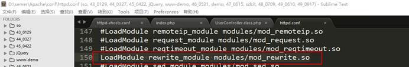

# 1、框架介绍

## 1.1 框架目录介绍

### 1.1.1 目录结构

 

### 1.1.2 核心目录

 i

### 1.1.3 conf目录

 

**说明：**在ThinkPHP中除了这个convention.php配置文件之外，还有其他的配置文件。但是convention.php这个文件是系统级别的配置文件，还有一个是应用级别的配置文件，最后还有一个分组级别的配置文件。


### 1.1.4 library目录

 

### 1.1.5 think目录

 


## 1.2 配置虚拟主机

 


## 1.3 细节问题

### 1.3.1 自动生成

在首次运行index.php入口文件的时候会产生相应的应用目录结构，目录的名字取决于在index.php中定义的常量APP_PATH。

### 1.3.2 目录安全文件

index.html文件的作用，防止列出站点目录的结构信息

### 1.3.3 访问流程

 

### 1.3.4 默认访问

在部署之后访问会看到一个笑脸，笑脸是怎么输出的？在配置文件中配置有，默认的分组、控制器和方法，默认情况下会访问配置的模块、控制器和方法

```php
'DEFAULT_MODULE'         => 'Home', // 默认模块
'DEFAULT_CONTROLLER'     => 'Index', // 默认控制器名称
'DEFAULT_ACTION'         => 'index', // 默认操作名称
```


# 2、控制器

**控制器命名规则**

```php
// 控制器名称
Controller.class.php

// 例如
UserController.class.php
```


**控制器的编写位置**

```php
Application\Home\Controller
```


**自定义控制器**

自定义控制器按照以下步骤实现

- 书写名称空间：分组名\Controller
- 引入父类控制器：use Think\Controller
- 定义控制器名称并且继承父类控制器

```php
<?php
//1、书写名称空间
namespace Home\Controller;
//2、引入父类控制器
use Think\Controller;
//3、定义控制器并且继承父类控制器
class UserController extends Controller{

	//测试方法
	public function test(){
		phpinfo();
	}
}
```

关于命名空间

- 命名空间是在php5.3版本中引入的一个概念，所以ThinkPHP3.2.3要求大于等于5.3版本的php。
- 命名空间本身跟目录没有关系，但是在ThinkPHP中命名的声明和使用必须跟目录挂钩。


# 3、路由

路由是指访问项目中某个项目的方法的URL，路由形式有四种

- 普通路由形式（get形式路由）
- PathInfo形式路由
- ReWrite形式路由
- 兼容形式路由


**1、普通形式路由（get）**

http://网址/入库文件?m=分组名&c=控制器名&a=方法名&参数名=参数值

例如：<http://www.cigar.com/cigar/index.php?m=Home&c=User&a=test&id=1> 


**2、pathinfo形式路由（默认）**

http://网址/入库文件/分组名/控制器名/方法名/参数名/参数值

<http://www.cigar.com/cigar/index.php/Home/User/test/id/100> 


**3、ReWrite形式路由**

 http://网址/入库文件/分组名/控制器名/方法名/参数名/参数值

<http://www.cigar.com/cigar/Home/User/test/id/100> 


注意：

- 此方法不能直接使用，需要进行一下配置
  - 需要修改Apache配置文件httpd.conf，开启重写模块，去掉之前的注释符

     

  - 需要修改虚拟主机配置文件，给需要开启重写的站点目录配置处添加allowoverride，并且值是all

- 这种路由形式需要Apache的支持，而除了Apach软件之外服务器软件还有nginx、lightd等等，所以第三种路由形式一般情况下不推荐使用。 


**4、兼容路由形式**

http://网址/入口文件?s=入库文件/分组名/控制器名/方法名/参数名/参数值

<http://www.cigar.com/cigar/index.php?s=Home/User/test/id/100> 


**特别说明：**路由形式的配置值，不影响我们在地址栏中直接输入其他形式路由访问。该配置项的值影响的是ThinkPHP系统封装的URL组装函数（U函数）的生成url地址的形式。 


# 4、控制器跳转

**URL组装**

- Url组装就是根据某个规则，来组成一个url地址，这个功能就叫做url组装。

- 在ThinkPHP提供了一个U方法来处理url的组装。该方法都定义在系统的函数库文件中（functions.php）


U函数的使用方法

```php
U("[分组名/控制器名/]方法名"，array("参数1"=>"参数值1"，"参数2"=>"参数值2"))
```


**系统跳转**

有两种跳转方式：成功跳转和失败跳转

```
$this->success(跳转提示，跳转地址，等待时间);

$this->error(跳转提示，跳转地址，等待时间);
```


说明

- success和error方法在当前的控制器中并没有定义，其是父类控制器中已经定义好的方法，由于当前控制器继承了父类，所以可以直接使用。 
- 跳转提示必须有参数，跳转地址可以省略，省略则表示跳转到上一页。