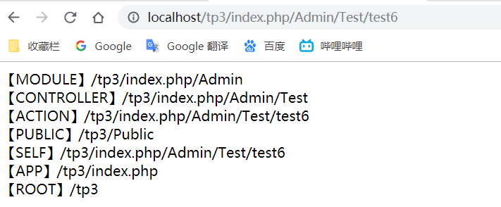

# 1、视图

视图就是MVC三大组分中的V（View），主要负责信息的输出和展示。

## 1.1 视图的创建

视图名称：一般与对应的**方法名**相同

创建位置：在**分组**目录下的**View**目录下与控制器**同名的目录**中。例如：`Test` 控制器中的 `Login` 方法要访问的模板文件，该模板文件 `login.html` 需要放到 `View/Test/login.html` 目录下


## 1.2 视图的展示

在PHP中使用 `display` 方法进行页面的展示，`display` 方法的语法有三种语法格式

```php
$this -> display();							   //展示当前控制器下与当前请求方法名称一致的模板文件
$this -> display("模板文件名");  		 	    //不带后缀  展示当前控制器下的指定模板文件
$this -> display("View目录的目录名/模板文件名");	//不带后缀  展示指定控制器目录下的指定模板文件
```


## 1.3 模板常量替换机制

> 在实际开发中经常会遇到这样的问题：在引入图片、css、js文件的时候，往往需要写一些复杂的路径，所以这个时候我们比较希望有一些特殊的常量将复杂的路径简单化，这时就涉及到模板常量替换机制

`ThinkkPHP` 中提供了下几个常用的模板常量：

- \__MODULE__：表示域名后面开始，一直到分组名结束的路由           /index.php/Admin
- \__CONTROLLER__：表示从域名后面开始一直到分组名结束的路由   /index.php/Admin/Test
- \__ACTION__：表示从域名后面开始一直到方法名结束的路由              /index.php/Admin/test
- \__PUBLIC__：站点根目录下 `Public` 目录的路由                                  /Public
- \__SELF__：表示从域名后面开始一直到路由的最后，包括参数名和参数值。如果没有参数，则和 `ACTION` 相同
- \__ROOT__：当前网站地址
- \__APP__：当前应用地址


**案例显示结果**



> 为什么上述的几个常量就可以表示上面输出的这些路由呢？
>
> 答：在ThinkPHP中“模版常量”是通过模版内容替换机制来实现的，并非是常量的定义。替换机制可以查看行为文件ContentReplace.Behaviour.class.php
>


## 1.4 变量分配

> 在实际开发中不仅仅是展示一个模板这么简单，往往还需要展示一些数据，这个时候变量还在控制器方法中，需要将变量传递到模板中，这个过程叫做**变量分配**

常见的变量分配大致有四种场景

- 简单数据的分配
- 一维数组的分配
- 二维数组的分配
- 对象变量的分配


### 1.4.1 简单变量的分配

`PHP` 中提供了一个变量分配的方法，这个方法叫 `assign` ，具体语法是

```php
//在代码中传值
$php中的变量 定义
$this -> assign('模板中的变量名'，$php中的变量名);

//在页面内取值
{$模板中的变量名}
```


### 1.4.2 数组的分配

**1、获取模板内容**

fetch方法用来获取模板文件的内容，它有返回值，若需要显示需要单独打印

```PHP
// 获取模板文件，将返回结果保存到$str变量中
$str =  $this -> fetch();

// 打印该变量，该方法由thinkPhP提供，定义在functions.php文件中
dump($str)；
```

**2、视图中的注释**

普通的 `html` 注释，在页面中不会显示出来，但是会在源代码中显示，而 `ThinkPHP` 中的注释有两种

- 行注释：{//行注释内容}    不会在浏览器中显示出来，也不会显示在源代码中
- 块注释：{/*块注释内容* /}    不会在浏览器中显示出来，也不会显示在源代码中

注意

第一：行注释不要当作块注释来写（横跨多行）；

第二：在行注释和块注释当中（大括号里面）不要再出现大括号（模版变量）；

**3、 数组的分配**

- 在代码中执行数据分配

  ```php
  public function test6(){
      //定义要分配的一维数组
      $arr1 = array("西游记","红楼梦","水浒传","三国演义");
      
      //定义要分配的二维数组
      $arr2 = array(
          array("孙悟空","唐僧"),
          array("贾宝玉","林黛玉"),
          array("误用","李逵"),
          array("孙权","诸葛亮")
      );
      
      //执行分配数据
      $this -> assign("arr1",$arr1);
      $this -> assign("arr2",$arr2);
      
      //执行页面跳转
      $this -> display();
  }
  ```

- 在模板文件中进行数据的接收，有两种方式接收数据

  - 方括号方式 {$arr[index]}
  - 点方式 {$arr.index}

  ```html
  <body>
  	一维接受数组数据:<br>
  	括号方式:{$arr1[0]} - {$arr1[1]} - {$arr1[2]} - {$arr1[3]}<br>
  	点方式:{$arr1.0} - {$arr1.1} - {$arr1.2} - {$arr1.3}<hr>
      
  	二维数组接受方式：<br>
  	中括号方式：{$arr2[0][0]} - {$arr2[0][1]} - {$arr2[1][0]} - {$arr2[1][1]}<br> 
  	点方式：{$arr2.2.0} - {$arr2.2.1} - {$arr2.3.0} - {$arr2.3.1}
  </body>
  ```


### 1.4.3 对象的分配

- 定义实体类

需要注意：在命名空间的语法要求中，如果不写命名空间（也不使用include、require），系统会默认先去当前空间下去寻找需要的元素，如果找不到，则报错。

为了在后期使用中文的时候不乱码，可以在入口文件（index.php）中添加一个header声明字符集：

```php
header('Content-Type:test/html;charset=utf-8');
```

- 在代码中执行对象分配

  ```php
  public function test7(){
      $stu = new Student();
      $stu -> id = "10086";
      $stu -> name = "张三";
      //dump($stu);
      $this -> assign("stu",$stu);
      $this -> display();
  }
  ```

- 在模板文件中获取对象属性

  ```php+HTML
  <body>
  	冒号法获取对象中的属性：{$stu:name}-{$stu:id}<br>
  	箭头法获取对象中的属性：{$stu->name}-{$stu->id}
  </body>
  ```


## 1.5 系统变量

在 `thinkPHP` 中，系统提供了以下几个系统级别的变量（超全局变量在模板中的使用）

- $Think.server		       等价于  \$_SERVER，获取服务器的相关信息
- $Think.get                     等价于  \$_GET，获取 `get` 提交的相关信息
- $Think.post                   等价于  \$_POST，获取 `post` 提交的相关信息
- $Think.request             等价于  \$_REQUEST，获取 `get` 和 `post` 提交的相关信息
- $Think.cookie               等价于  \$_COOKIE，获取 `cookie` 中的相关信息
- $Think.session             等价于  \$_SESSION，获取 `session` 中的相关信息
- $Think.config               获取 `thinkPHP` 中所有配置文件的总和

在模板中使用以上变量的格式都一样

```php
{$Think.xxx.具体的元素下标}
```


例如

```html
<body>
	$Think.Server.Path = {$Think.Server.Path}<br>
	$Think.get.id = {$Think.get.id}<br>
	$Think.request.id = {$Think.request.id}<br>
</body>
```


## 5.6 视图中使用函数

在实际开发中，有些变量不能直接使用，需要进行一些处理，例如对于时间的而格式化，这时就需要使用函数


**示例一：**传递一个时间戳（毫秒值），使用视图中的函数进行格式化显示

- 代码中传递一个时间戳

```php
public function test8(){
		$time = time();
		$this -> assign("time",$time);
		$this -> display();
	}
```

- 页面中调用函数进行格式化显示

```html
<body>
	{$time|date='Y-m-d',###}		//显示结果 2019-07-05
</body>

// $time 表示模板变量
// date  表示要使用的格式化函数
// =     表示该函数需要的参数，用，进行分隔，不同用括号
// ###   表示该模板变量本身
// |     表示变量与函数或者函数与函数之间的分隔
```

> 注意:
>
> - \###的使用：当需要使用的函数只用一个参数且参数就是变量本身，###可以省略不写
>
> ​                              当需要使用多个参数，但是第一个参数时变量本身时，也可以省略不写
>
> - 函数的使用：函数名必须是PHP中内置的函数或者是在函数库文件中定义好的函数


**示例二：**截取英文字符串的前五个字符，并且将其转化为大写

- 在代码中传递字符串

```php
public function test8(){
    $str = "aBCdEfGhijKLmn";
    $this -> assign("str",$str);
    $this -> display();
	}
```

- 在页面中进行格式化显示

```html
<body>
	{$str|substr=0,5|strtoupper}
</body>

// substr 有三个参数,第一个省略,即为变量本身
```


## 5.7 变量默认值

默认值就是当某个变量不存在或者为空串的时候，会默认显示的字符。

语法：

```php
{$variable | default = 默认值 }
```

演示

- 在代码中传值

```php
public function test8(){
    $sign = "";
    $this -> assign("sign",$sign);
    $this -> display();
}
```

- 在页面中显示

```html
<body>
	{$sign|default="这个人很懒，什么都没留下"}
</body>

// 如果 $sign 不存在 或者 为空串则会显示默认值
```


## 5.8 运算符

```PHP
+		{$a+$b}		计算变量a加上变量b的结果
-		{$a-$b}		计算变量a减去变量b的结果
*		{$a*$b}		计算变量a乘以变量b的结果
/		{$a/$b}		计算变量a除以变量b的结果
%	    {$a%$b}		计算变量a除以变量b的余数
++	    {$a++}      或 {++$a}	自增运算
--   	{$a--}      或 {--$a}	自减运算
```


## 5.9 文件包含

在ThinkPHP中系统提供了一个模版标签，可以让我们引入一些公共部分的代码文件，这个标签是include标签：**

**包含标签**

```php
<include file="需要引入的模板文件相对于入口文件的目录（需要加文件后缀名）"/>
```

**例如**

```php
<include file='Application/Admin/View/Test/head.html'>
```


**可使用另一种简单的方法**

```php
<include file='View目录名/模版文件名(不加后缀名)' />
```

**上述的代码可以改写成**

```php
// 该方式不需要加后缀名
<include file='Test/foot'>
```


## 5.10 循环遍历

如果参数分配到模板文件的参数是数组，则往往需要对其进行遍历。在 `thinkPHP` 中，有两种标签用来遍历

- volist
- foreach

**使用格式**

```php+HTML
<volist name='要遍历的变量，前面不加$' id='每一个元素' key='遍历序号，从1开始'>
	//遍历主体
</volist>

<foreach name="要遍历的变量，前面不加$" item="每一个元素" key='遍历序号，从0开始'>
    //遍历主体
</foreach>
```


**演示**

- 代码中传递数组

```php
public function test9(){
    //定义要分配的一维数组
    $num = 1;
    $arr1 = array("西游记","红楼梦","水浒传","三国演义");
    //定义要分配的二维数组
    $arr2 = array(
        array("孙悟空","唐僧"),
        array("贾宝玉","林黛玉"),
        array("吴用","李逵"),
        array("孙权","诸葛亮")
    );
    //执行分配数据
    $this -> assign("num",$num);
    $this -> assign("arr1",$arr1);
    $this -> assign("arr2",$arr2);
    //执行页面跳转
    $this -> display();
}
```

- 前台页面进行遍历获取

```html
<body>
	一维数组的遍历：<br>
	<volist name='arr1' id='vo' key='k'>
		{$k}->{$vo}<br>
	</volist>
	<hr>
	<foreach name="arr1" item="name" key='k'>
		{$k}->{$name}<br>
	</foreach>
	<hr>

	二维数组的遍历：<br>
	<volist name = 'arr2' id = 'vol' >
		<volist name = 'vol' id = 'vo' key = 'k'>
			->{$vo}、
		</volist>
		<br>
	</volist>
</body>
```


**区别**

- `volist` 支持更多标签，如：`mod` 、`key` 、`length`等等
- `foreach` 只支持 `key` 属性，可以理解成 `volist` 标签的简化版本


## 5.11 if标签

`if` 标签用来进行分支结构的判定

**使用语法**

```php
	<if condition="判断条件一">
		//显示内容1
	<elseif condition="判断条件2"/>
		//显示内容2
	<elseif condition="判断条件3"/>
		//显示内容3
	<else/>
		//显示内容4
	</if>
```

**案例演示**

- 代码中传递值

```php
public function test10(){
    //传递变量，一周的第N天
    $day = date(N);
    $this -> assign("day",$day);
    $this -> display();
}
```

- 页面中进行逻辑判断

```html
<body>
	<if condition="$day==1">
	星期一
	<elseif condition="$day==2"/>
	星期二
	<elseif condition="$day==3"/>
	星期三
	<elseif condition="$day==4"/>
	星期四
	<elseif condition="$day==5"/>
	星期五
	<else/>
	周末
	</if>
</body>
```


## 5.12  php标签

`php` 标签就是指在代码中嵌入 `php` 代码，模板中支持两种标签格式

- `php` 原生的标签写法，使用 `<?php           ?>` 的标签进行表示
- `thinkPHP` 封装的标签，使用 `<php>      </php>` 的标签进行表示

**案例演示**

- 直接在代码中进行页面跳转

```php
public function test11(){
    $this -> display();
}
```

- 在模板文件运行 `php` 代码

```php+HTML
<body>
	<?php echo "hello world"; ?>
	<php>echo "hello world";</php>
</body>
```

> 注意：一般不推荐这样使用，因为不符合MVC模式，页面上的代码混乱，不便于维护。
