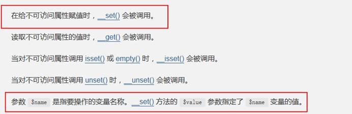
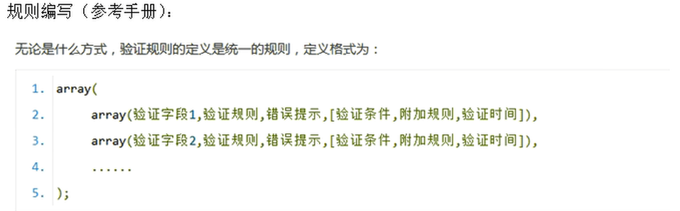

# 1、模型

## 1.1 连接数据库

一般一个应用只需要连接一个数据库，所以在应用级别的配置文件中配置数据库的连接信息

```php
// 定义数据库配置项
'DB_TYPE'                => 'mysql', // 数据库类型
'DB_HOST'                => 'localhost', // 服务器地址
'DB_NAME'                => 'db_oa', // 数据库名
'DB_USER'                => 'root', // 用户名
'DB_PWD'                 => 'root', // 密码
'DB_PORT'                => '3306', // 端口
'DB_PREFIX'              => '', // 数据库表前缀
```


## 1.2 创建模型类

命名规范：模型名（要求是不带前缀的表名并且首字母大写）+Model关键词+.class.php

代码结构规范

- 声明命名空间

- 引入父类模型Model.class.php

- 声明模型并且继承父类模型

 

例如

```php
// 文件名示例
DeptModel.class.php
    
// 代码示例
namespace Admin\Controller;

use Think\Controller;

class TestController extends Controller
```


> 问：空模型能否进行数据表的基本操作（CURD）？
>
> 答：可以，因为模型继承了父类，所以可以执行基本的操作。


## 1.3 模型的实例化

模型的实例化分为两种方法，一种是普通实例化方法，一种是快速实例化方法

- 普通实例化方法

```php
// 先引入对应模型类的名称空间
use \Admin\Model\DeptModel();
// 使用new关键字进行实例化
new DeptModel();
```

- 快速实例化方法：  

  ThinkPHP为我们提供了2个快速方法可以对模型进行实例化操作：
  - M方法
  - D方法


**D方法语法**

```php
$obj = D([‘模型名’]);
```

**D方法解读**

实例化我们自己创建的模型；如果传递了模型名，则实例化指定的模型，如果没有指定或者模型名不存在，则直接实例化父类模型（Model.class.php）。


**M方法语法**

```php
$obj = D([‘模型名’]);
```

**M方法解读**

直接实例化父类模型（Model.class.php）；如果指定了表名，则实例化父类模型的时候关联指定的表；如果没有指定表名（没有传递参数）则不关联表，一般用于执行原生的sql语句（M() -> query(原生的sql语句)）。

 

**案例演示**

```php
// 1 普通方法实例化模型对象 但是不推荐使用
    $dept = new DeptModel();   //默认会寻找与控制器同名数据库进行绑定
    dump($dept);

// 2 快速方法实例化模型对象   
//  M()方法直接实例化父类的模型
    $dept = M('Dept');     // 如果传递参数糊直接绑定对应数据表
    $dept = M();		   // 如果没有传递数据表,不会绑定数据表,通常用来执行原生的sql语句

//  D()方法优先实例化自定义的模型
    $dept = D('Dept');     // 优先实例化自定义的子类模型,如果参数传递错误会实例化父类模型
    $dept = D();		   // 实例化父类模型,与M()类似
```


**经典面试题**

> 问：实例化方法中D方法和M方法有什么区别？
>
> 答：D方法是实例化自定义模型，如果自定义模型不存在，则实例化父类模型；M方法本身就是直接实例化父类模型。两者的差异就是实例化的对象不一样。
>

**怎么选择**

> 可以根据自身的情况，如果需要使用的操作父类中已经封装好了，则可以直接实例化父类（使用M方法），如果父类中方法不能满足我们的开发需要求，需要自己定义方法，则这时可以使用D方法实例化自定义模型。
>


## 1.4 增删改查

### 1.4.1 添加

添加记录使用add方法

- 返回值为新增记录的主键id
- 参数为关联数组，数组的键与数据表的字段一一对应

**语法结构**

```php
$model -> add(一维关联数组);
```


**案例演示**

```php
// 添加使用add方法,参数为一维关联数组,键与数据库字段一一对应,返回值为新增记录主键
    $model = M('Dept');
    $data= array(
        'name'  => '公关部',
        'pid'   => 1,
        'sort'  => 5,
        'remark'=> '公共关系维护'
    );
    $result = $model->add($data);  
    dump($result);
```


### 1.4.2 修改

修改使用save方法

- 返回值为影响的记录数
- 参数为一维关联数组，数组的键与数据表字段名称一一对应，且主键必须指定，如果没有指定主键信息，则返回值是false，表明该操作未执行

**语法结构**

```php
$model -> save(一维关联数组);
```


**案例**

```php
public function testUpdateUser(){
    $model = M('Dept');
    $data = array(
        'id'   => 8,
        'pid'  => 5,
        'remark'=>'招人裁人'
    );
    // 使用save方法,参数为一维数组,必须包含主键,如果没有主键返回false,表示语句未执行,执行成功后返回影响的行数
    $result = $model->save($data);
    dump($result);
}
```


### 1.4.3 查询

在ThinkPHP中系统封装了方法可以直接用于查询：select方法、find方法。

 返回值：select方法返回值是一个二维数组，即使查询的是一条记录返回也是二维数组；find返回值是一维数组。


**select方法语法**

```php
$model -> select();                     // 表示查询全部的信息
$model -> select(id);                   // 表示查询指定id的信息
$model -> select(‘id1,id2,id3,id4’);    // 表示查询指定id集合的信息，等价于mysql中in语句
```

**find方法语法**

```php
$model -> find();              //表示查询当前表中的第一条记录，相当于limit 1;
$model -> find(id);            //表示查询表中的指定id的记录；
```


**案例**

```php
public function testSelectUser(){
    $model = M('Dept');
    // 查询可以使用两种方法实现
    // select() select(id) select('id1,id2') 依次查询全部 查询指定id 查询多个id 均返回二维数组
    
    $result = $model->select();
    $result = $model->select(8);
    $result = $model->select('7,8,9');

    // find()     find(id)   依次为查询第一条记录,查询指定id记录
    $result = $model->find();
    $result = $model->find(17);
    dump($result);	
}
```


### 1.4.4 删除

在ThinkPHP中可以使用系统封装的方法delete方法

返回值为影响的记录数

**方法语法**

```php
$model -> delete();                  // 不能使用，删除方法必须要有条件，不能执行没有条件的删除
$model -> delete(id);                // 删除指定id对应的记录
$model -> delete(‘id1,id2,id3’);     // 删除多个id对应的记录
```

**案例演示**

```php
public function testDeleteUser(){
    $model = M('Dept');
    // delete方法的两种用法 delete(id)  delete('id1,id2,id3') 返回删除记录数
    //$result = $model->delete(18);
    $result = $model->delete('19,20');
    dump($result);
}
```


# 2、AR模式

AR模式即Active Record模式，是一个对象-关系映射（ORM）技术。每个AR 类代表一张数据表，数据表的字段在 AR 类中体现为类的属性，一个AR 实例则表示表中的一行。

**AR模式的核心：三个映射**

- AR类       		    =>   	    表 （模型类关联了数据表）
- AR类的属性        =>           表的字段
- AR类实例            =>           表的记录


**AR模式的语法格式**

```PHP
// AR模式在ThinkPHP中的典型的应用：CURD操作
    
//实例化模型
$model = M(关联的表);

//字段映射到属性
$model -> 属性/表中字段 = 字段值;
$model -> 属性/表中字段 = 字段值;
…
//AR实例（操作）映射到表中记录
$model -> CURD操作;  CURD操作没有参数
```


## 2.1 增加

添加记录使用add()方法实现

```php
// 测试AR模式下的部门
public function test13(){
    //实例化模型对象，映射到表
    $model = M("Dept");

    //给对象的属性赋值，映射到字段
    $model -> name = "交付部";
    $model -> pid = "10";
    $model -> remark = "这是交付部门";

    //执行增加操作，映射记录，返回值为新增记录id
    $model -> add();
}
```


> **问题1**：难道父类模型中真的有name、pid、sort、remark属性么？
>
> 答：通过观察父类模型的底层实现，我们找到了一个特殊的魔术方法__set：
>
>  
>
> 赋值成功之后可以打印模型查看到模型中存在属性data


> **问题2**：为什么add方法没有参数也能执行添加操作？
>
> 答：通过问题1中的解答可以得知如果使用AR模式的话，data属性是有值，然后通过查看add方法的底层实现：其中判断是否给add方法传递参数，如果没有传递，则使用父类模型中data属性中值，而data属性中的值恰恰就是问题1中的数据。


## 2.2 修改

修改使用save()方法实现，但是需要指定id

```php
//测试AR模式下的修改
public function test15(){
    //实例化模型对象
    //$model = new \Admin\Model\DeptModel();
    $model = M("Dept");

    //添加修改信息
    $model -> id = "1";
    $model -> pid = "11";
    $model -> remark = "交付部门能顶半边天!";

    //执行修改操作，返回值为影响记录数
    $result = $model -> save();
    dump($result);
}
```


**注意**

- 不管是通过save方法传递数组，还是使用AR模式，修改的时候都必须传递主键id
- 在AR模式下，更新和删除必须指定主键信息，但是有一种情况下可以不指定逐渐也能执行更新和删除操作。在之前做过查询语句，后面入宫没有指定逐渐，会操作当前查询到的记录

```php
//测试AR模式下查询后 不指定ID 进行更新
public function test16(){
    //实例化模型对象
    $model = M("Dept");

    //查询
    $data = $model -> find(5);
    dump($data);
    echo '<hr>';

    //不再指定id 直接进行更新
    $model -> pid = 10;
    $result = $model -> save();
    dump($result);
}
```


## 2.3 删除

删除使用delete方法实现

```php
//测试AR模式下的删除指定记录
public function test17(){
    //$实例化模型对选哪个
    $model = M("Dept");
    //定制要删除的主键
    $model -> id = "2,3";

    //删除
    $result = $model -> delete();
    dump($result);
}
```


## 2.4 查询

AR模式下没有查询操作，查询还是使用之前的find和select方法


## 2.5 辅助方法

在原生的sql语句中除了我们目前所使用的基本的操作之后，还有类似于group、where、order、limit等等这样的子句。所以ThinkPHP封装了相应的子句方法：

- where              表示限制查询的条件
- limit                  表示限制输出的条数
- field                  表示限制输出的字段  也就是select id，name，pid这样的语句
- order                表示按照指定的字段进行指定的排序
- group                示按照指定的字段进行分组查询


### 2.5.1 where方法

- 作用：限制查询的条件。
- 原生语句：select 字段 from 表 where  条件;

 

在ThinkPHP中系统封装了一个where方法来实现在原生的sql语句中where效果。

**语法**

```php
// 为模型指定where条件
// 在ThinkPHP中条件表达式支持字符串形式也支持数组形式，推荐使用字符串形式
$model -> where(条件表达式);

$model -> CURD操作;
```


**案例**

```php
//使用where方法查询部门表中部门id大于20的数据。
public function test18(){
    $model = M("Dept");

    $model -> where("id > 5");
    $result = $model -> select();
    dump($result);
}
```


> 问题：where子句和having子句有什么区别？
>
> 答：两个语句都表示限制查询条件，但是意义上有差异，where表示限制查询条件，但是要求条件中的字段必须是数据表中存在的字段；而having要求条件中的字段必须是结果集中存在的。


### 2.5.2 limit方法

- 作用：限制输出的条数
- 典型应用：数据分页
- 原生语句：select 字段 from 表 where 条件 limit 限制的条数;

 

在ThinkPHP中系统提供了limit方法来实现原生的sql语句中限制条数的效果：

​         第一种：$model -> limit(n);           //n表示大于0的数字，表示输出表中的前n行

​         第二种：\$model -> limit(起始位置,偏移量/长度);     //表示从第起始位置开始，往后查询指定长度的记录数，在实际使用的时候该种方法还支持写成$model -> limit(‘起始位置,偏移量’);

```php
//limit子句
public function test19(){
    $model = M("Dept");

    //限制查询两条
    //$model -> limit(2);

    //从第一条开始,查询两条
    //$model -> limit(1,2);
    $model -> limit("1,2");

    $result = $model -> select();
    dump($result); 
}
```


### 2.5.3 field方法

作用：限制输出的结果集字段

**语法**

```php
// 参数也就是select之后到from之前的那一串字符串
$model -> field('字段1,字段2,字段3,字段4 [as别名]');     
```


**案例**

```php
// 使用field方法来查询部门表中的数据，只要显示id和name就可以
public function test20(){
    $model = M("Dept");

    $model -> field("id,name,remark");
    $result = $model -> select();
    dump($result);
}
```


**注意：上述三个方法在父类模型中都是真实存在的**。 


### 2.5.4 order 方法

作用：指按照指定的字段进行指定规则的排序。

原生语句：order by 字段 排序规则（升序asc/降序desc）。

**语法**

```php
$model -> order(‘字段名 排序规则’);
```


**案例**

```php
// 使用order方法查询部门表中的数据，并且按照id进行降序排列
public function test21(){
    $model = M("Dept");

    $model -> order ("id desc");
    $result = $model -> select();
    dump($result);
}
```


### 2.5.5 group方法

作用：分组查询

**语法**

```php
$model -> group(‘字段名’); 
```


**案例**

```php
// 使用group的方法去查询部门表，要求查询出部门名称和出现的次数。
public function test22(){
    $model = M("Dept");
    
    // 统计每个部门的记录数
    $model -> field("id,name,count(name) as count");
    $model -> group ("pid");
    
    $result = $model -> select();
    dump($result);
}
```


**说明：上面2个方法（order、group）在父类模型中是不存在的，其在使用的时候是通过魔术方法__call来实现后续的处理的。** 


### 2.5.6 连贯操作

连贯操作：所谓连贯操作就是将辅助方法全部写在一行上的写法，这样的形式叫做连贯操作。

**语法形式**

```php
$model -> where() -> limit() -> order -> field() -> select();
```


**注意：辅助方法的顺序，在连贯操作中没有要求，只要符合模型在最前面，CURD方法在最后面即可。**


**案例**

```php
public function test22(){
    $model = M("Dept");
    $result = $model -> field("id,name,count(name) as count") -> group("pid") -> select();
    dump($result);
}
```


> 解疑：连贯操作上的辅助方法啊为什么可以写在一行上呢？
>
> 答：原因就是每一个辅助方法最后的返回值都是$this，而$this是指当前的模型类，由模型类去调用后续的辅助方法，这个是可以行得通的。这也是为什么要求CURD方法必须放在最后的原因。


## 2.6 统计查询

在ThinkPHP中系统提供以下几个查询方法的使用，方便于在后期需要做统计的使用。

- count()		表示查询表中总的记录数
- max()           表示查询某个字段的最大值
- min()            表示查询某个字段的最小值
- avg()             表示查询某个字段的平均值
- sum()           表示求出某个字段的总和


**语法**

```php
// 查询总记录数
$model -> [where() ->] count();
```

**案例**

```php
// 使用AR模式下的统计函数
public function testARSelect6(){
    $model =M('Dept');

    // 该返回结果也是正确的值,但是二维数组
    //$res = $model->field('count(*)')->select();

    // 返回字符串类型的数字
    $res = $model->count();
    dump($res); 
}
```


# 3、模型进阶

## 3.1 创建数据对象

- 数据对象也就是父类模型中的data属性，其本质是一个数组
- 前面调用 `$this->属性值` 的格式设置数对象的本质是使用了魔术方法__set
- 而__set是设置数据对象的一种方法，但是这种方式设置一个属性就得写一行代码，使用并不方便
- ThinkPHP中系统还提供另外一种批量设置数据对象的方法：create方法。


**语法**

```php
$model -> create();
```


**说明**

- 关于传参数：如果不给他传递参数，他会默认使用使用Post中传递的数据
- 关于返回值：
  - 正常情况下，该方法会返回模型类的data属性，也即数据对象
  - 执行该方法过程会经过自动验证等过程，如果验证失败，则返回false


**案例**

​         第一：将处理完成的data数据赋值给了data属性，这步就是创建数据对象。

​         第二：将处理完成的数据返回出去。

案例：改写之前编写的部门信息入库的一个代码，使用数据对象的创建方式。

```php
// $model = M('Dept');
// $res = $model->add($data);

// 使用create方法创建数据模型
$model = D('Dept');

// 创建过程会进行自动验证,如果验证失败返回false
$data = $model -> create();  // 如果不传递参数,默认使用$data属性接收post提交数据并返回
```
> 说明：如果表单中字段和数据表中字段不匹配，则在创建数据对象的时候会被过滤掉。


## 3.2 自动验证

- 自动验证就是在提交数据的时候系统会按照指定的**规则**进行数据的有效性、合理性的验证。
- 如果需要使用自动验证，规则需要我们**自己定义**。
- 如果需使用自动验证，则**必须**要用数据对象创建方法进行接收数据。 
- 在父类模型中存在一个成员属性，叫做_validate，这个属性是保存验证规则的。由于不能在父类模型中直接更改属性，所以可以把这个属性复制**到子类（自定义模型）中去定义规则**。 


**规则格式**



**必选参数**

- 验证字段：表单中每一个表单项的name值
- 验证规则：就是针对验证字段的要求格式的限制，常见规则有require字段必须、email 邮箱、url URL地址、currency货币、number 数字。
- 错误提示：在验证不合理的时候给用户提示信息。

**可选参数**

- 验证条件：0表示字段存在就验证（默认），1表示必须验证，2表示字段不为空的时候验证
- 附加规则：结合验证规则，两者配合起来使用。具体支持的方法，可以参考手册自动验证
- 验证时间：1表示新增数据的时候验证，2表示编辑的时候验证，3表示全部情况下都验证（默认）

 

**案例**

```php
// 自动验证规则定义在对应的模型中，实例化模型时会使用该模型模型进行验证
protected $_validate = array(
    // 验证name不能为空
    array('name','require','部门名称不能为空!'),
    // 验证name不重复
    array('name','','部门名称已存在',0,'unique'),
); 
```


**注意**

- **因为规则是定义在自定义模型中，所以模型在实例化的时候必须需要实例化自定义模型**。 -
- 如果自动验证失败，则create方法返回false，如果验证成功，则返回正常的数据对象，也即data数组
- 如果在自动验证中使用函数来验证字段的合法性，则第二个参数要求是函数名（函数名要是函数是php内置的函数或者自己定义的函数）。


 **辅助方法**

```php
// 如果验证失败，用于获取错误信息
$model -> getError();
```


**案例**

```php
//定义添加部门方法
public function add(){
    //创建模板对象
    $model = D("Dept");
    //调用数据对象创建方法，如果编写了验证规则，创建过程会调用验证机制
    $data = $model -> create();	
    //验证规则在模块中书写，在此处理验证结果
    if ($data) {
        //验证成功则执行添加操作
        $result = $model -> add();
        //添加结果判断
        if ($result) {
            $this -> success("添加成功",U("showList"),3);
        } else {
            $this -> error("添加失败");
        }
    } else {
        //验证失败,获取错误信息,进行页面
        $this -> error($model -> getError());
        exit();
    }				
}
```


**批量验证**

上述验证验证一旦出错会直接返回，不再执行后面的验证过程，可以使用此方法开启批量验证

```php
// 在模块中进行配置，添加以下代码，如果验证多处失败，则会返回一个一维数组
protected $patchValidate = true;
```


## 3.3 映射关系

- 映射就是一个对应关系。通过映射关系，我们可以让表单字段名和数据库字段明不完全相同，从而避免了一些人通过系统漏洞，对数据库进行攻击。
- 通过查看模型类中的parseFieldsMap 方法可知，$_map中保存映射关系，所以可以通过该属性配置映射关系
- 因为该成员属性是父类成员属性，所以不能在父类中直接定义，需要在子类模块中定义


**定义案例**

```php
//字段映射关系
protected $_map  = array(
    name1 => name,
    sort1 => sort
);
```


## 3.4 特殊表的实例化

由于配置文件中配置了数据表名的前缀，如果实际的数据表名不符合所配置的前缀，就需要单独进行配置

```php
//在自定义模块中配置真实数据表名,此时模型实例化时会忽略配置的前缀
protected $trueTableName = 'dept';
```

