# 1、实用项

在开发的时候我们往往会需要一些开发的错误，需要去解决错误，一般这个时候我们比较需要借助于开发工具/调试工具，在ThinkPHP中系统为了方便我们在开发的时候对代码进行调试，也封装了一系列的调试方法：

-  跟踪信息

-  两种模式

-  Sql调试
-  性能调试


## 1.1 跟踪信息

开启配置   应用级别的配置文件 Application/Common/Conf 中手动添加配置项目

在ThinkPHP中跟踪信息默认是关闭的，可以通过以下配置项配置开启：

```php
'SHOW_PAGE_TRACE'   => true,
```

> 说明：上述的配置项在主配置文件中是不存在的（在ThinkPHP中除了主配置文件中已经列出的配置项外，还存在一些零星的配置项，这些配置项在主配置文件中不存在，但是其他地方有使用），需要使用的话可以自己在配置文件中定义。
>


## 1.2 两种模式

在ThinkPHP系统为了方便开发，提供了以下两种模式：调试模式、生产模式。

- 调试模式：是指在开发调试阶段所使用的模式，错误信息比较详细；

- 生产模式：是指项目上线的时候所使用的模式，错误信息比较模糊；

 

模式配置项名字叫做**APP_DEBUG**。定义的位置在入口文件中：index.php

```php
// 开启调试模式 建议开发阶段开启 部署阶段注释或者设为false
define('APP_DEBUG', true);
```


> 说明：
>
> - 在生产模式下系统函数库文件functions.php、系统的配置文件、应用配置文件没有被加载，但是多了一个common~runtime.php文件（没有被加载的配置文件的配置项都放到了新增文件中）。
> - 相比调试模式，生产模式下使用缓存文件common~runtime.php，所以效率上要比调试模式高。

 

> 注意：
>
> 如果在**生产模式下**去修改主配置文件/应用级别配置文件/系统函数库文件是否会生效呢？
>
> 答：不会，因为在生产模式上述的几个文件压根都没有被加载，所以修改无效。如果想让它生效，可以把缓存文件common~runtime.php删除掉，或者开启调试模式去修改，修改完成再换回生产模式。
>


## 1.3 sql调试

在开发的时候，难免会遇到sql的错误，这个时候需要对sql进行调试，因为ThinkPHP在执行CURD操作的时候是让开发者写方法，并不是很直观的sql，我们可以调用模型的方法来获取执行的sql语句：

### 1.3.1 getlastSql

**语法**

```php
// 获取当前模型中最后一条执行成功的sql语句
$model -> getLastSql();

// 上述方法还有个简化方法，可以达到相同的目的
$model -> _sql();
```


**案例**

```php
// 使用getLastSql方法获取最后一个sql语句
public function testSql(){
    $model = M();
    //$result = $model->query('select * from dept');
    $result = $model->execute("update dept set remark = '天大地大我最大' where id = 9");
    
    // 获取最后一条成功执行的sql语句
    $sql = $model->getLastSql();
    dump($result);
    dump($sql);
}
```


### 1.3.2 **fetchSql**

前面我们介绍了sql调试的一个方法getLastSql或者别名_sql()，但是这个方法要求最后一条**成功执行的**sql，所以如果拿这个方法来调试sql，只能是调试逻辑错误，并不能拿来调试语法错误

另一个方法fetchSql：使用fetchSql之后原有的连贯操作**没有被执行**，而是直接将连贯操作的语法组成的sql语句给返回。

**语法**

```php
// 获取组装好的Sql语句
$model -> where() -> limit() … -> order() -> fetchSql(true) -> CURD操作;
```


> 注意：FetchSql方法使用的时候可以完全看作是一个辅助方法，所以要求必须在model之后，在CURD操作之前，顺序无所谓。


## 1.4 性能模式

在ThinkPHP中系统提供了一个性能测试的快速方法，这个快速方法叫做G

**G方法的语法**

```php
G(‘开始标记’);
需要统计效率的代码段
……
G(‘结束标记’);
G(‘开始标记’,’结束标记’,数字/字符m);
```

**案例演示**

```php
public function testG(){
    // 定义开始标记
    G('start');
    for($i = 0; $i <= 100000; $i++){
        echo $i;
    }
    // 定义结束标记
    G('stop');
    echo '<br>';
    // 记性计算过程
    echo G('start','stop',4);
}
```


> 说明：第三个参数如果是数字，则表示统计代码的执行时间，数字表示精确的小数位数，单位是秒；如果是字符m，则表示统计内存开销，单位是byt（需要服务器的支持）。
>


# 2、会话控制

会话支持一般都是指的是cookie和session。在php核心中有说及php对于cookie和session支持，在ThinkPHP中系统为了方便开发的使用，也封装了相应cookie和session方法。 

## 2.1 session支持

在ThinkPHP中，系统封装了一个方法用来操作session

```PHP
// 创建一个名为name的session值，值是value
session('name','value')

// 读取session中的name元素值，值赋给value
$value = session('name')

// 删除名为name元素的值
session('name',null)

// 删除全部的session元素
session(null)

// 读取全部的session信息
session()

// 判断名为name的session元素是否存在，存在则返回true，如果不存在，返回false。
session('?name')         
```


**演示**

```php
// 创建session
session('name','张三');
session('age','20');

// 获取session
$name = session('name');
dump($name);echo '<br>';
$age = session('age');
dump($age);echo '<br>';

// 删除session
session('name',null);
dump(session('name'));

//删除所有session
session(null);

// 获取所有session
dump(session());

// 判断session是否存在
dump(session('?age'));
```


## 2.2 cookie支持

在ThinkPHP中，系统封装了cookie方法来操作cookie

```php
// 设置一个名为name的cookie值，值是value
cookie('name','value');              

// 设置一个名为name的cookie值，值是value，有效期是3600s
cookie('name','value',3600);

// 读取名为name的cookie赋值给value
$value = cookie('name');

// 删除名为name的cookie值
cookie('name',null);

// 删除全部的cookie（有问题）
cookie(null);

// 获取全部的cookie
cookie();
```


**注意：在上述的几个方法使用中，cookie(null)这个方法有bug，虽然手册上写了说可以删除，但是在实际使用的时候并不能达到想要的效果。如果想这个操作可以实现则需要更改底层的实现代码**：

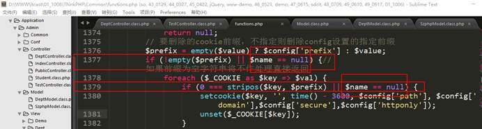 


# 3、文件加载

## 3.1 函数库形式加载

关于PHP的函数库文件

- 函数库有三大类：系统函数库文件、应用级别函数库文件、分组级别函数文件
- 上述三大类的文件只有系统函数库文件默认是存在的，其他两类默认不存在，需要**自行创建**
- 只有系统函数库文件名叫做functions.php，另外两大类文件名叫做function.php。

 

案例：使用函数库文件的形式定义需要的函数，函数名gbk2utf8


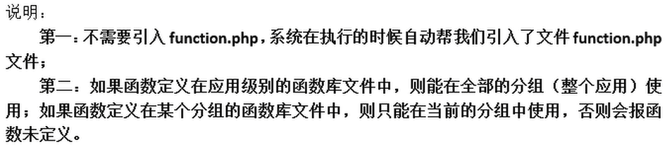

## 3.2 配置项动态加载

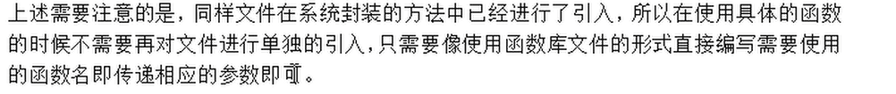

在应用级配置文件中配置，

```PHP
// 系统会加载应用级别下的Common/Common目录下的info.php文件
'LOAD_EXT_FILE' => 'info'
```

## 3.3 load方法加载

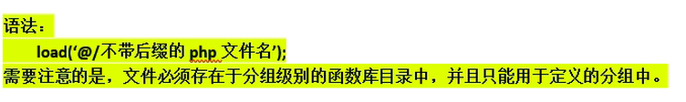

```PHP
public function test23(){
    testecho();
    phpinfo();
    load("@/hello");
    sayhello("hitty");
}
```

# 4、验证码类

Verify.class.php

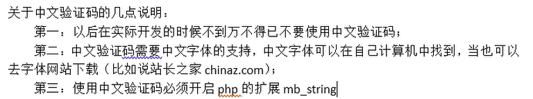


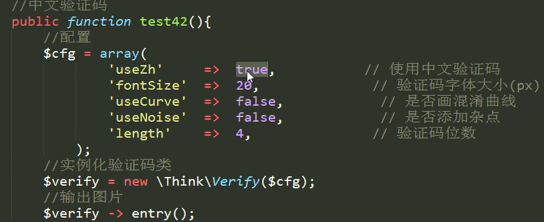


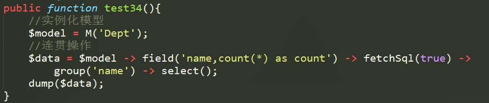


说明：通过跟踪信息和返回值，我们可以发现，使用fetchSql之后原有的连贯操作没有被执行（在跟踪信息中没有sql显示），而是直接将连贯操作的语法组成的sql语句给返回。 


表单提交：

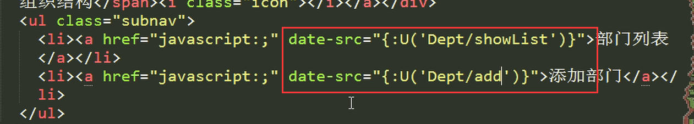

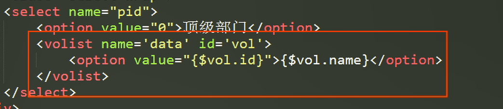


**第五步：处理表单信息的提交操作**

改写add方法，判断是否是post请求，如果是，则处理表单的提交，如果不是则展示模版。

扩展：如果判断请求是否是post？

答：要是在以前，我们可以使用if($_POST)来判断，但是在ThinkPHP中系统为我们封装了几个比较使用的常量，可以直接用常量来判断，常量常见的如下：

**IS_POST**           **如果请求是post****，则IS_POST****的值是true****，否则是false**

**IS_GET**

**IS_AJAX**      **如果请求是ajax****，则IS_AJAX****的值是true****，否则是false**       

IS_CGI

IS_PUT

…

 

关于数据接收的说明：

在之前我们使用的时候$_POST来接收数据，在ThinkPHP中，我们可以使用I方法（快速方法）来接收数据，I方法可以接收任何类型的输入（post、get、request、put等等），并且系统默认自带防sql注入的方法（使用php内置的函数htmlspecialchars）。

语法：

​         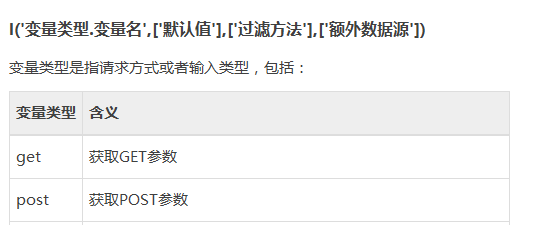


**变量类型就是类似get****、post****等等。**

**变量名就是指$_GET****或者$_POST****中具体元素下标。**

**默认值：是当使用过滤方法之后原先的内容如果变成了空字符串，则会使用默认值来代替。**

**过滤方法：是对ThinkPHP****默认提供的htmlspecialchars****的补充，函数名可以是php****内置的，也可以是函数库中的。**

 

**额外的说明：如果想接收整个数组则呢么呢？**

**如果想接收全部数据，则可以不写变量名，可以写成I(‘get.’);**


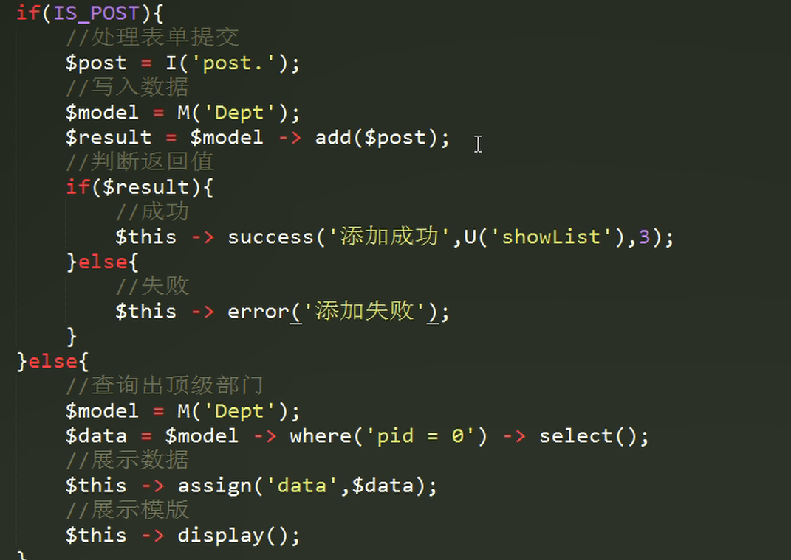


